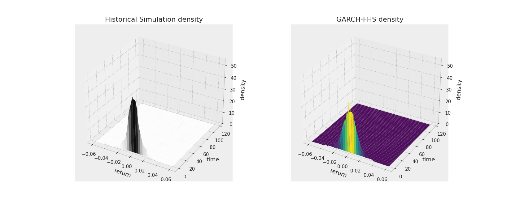
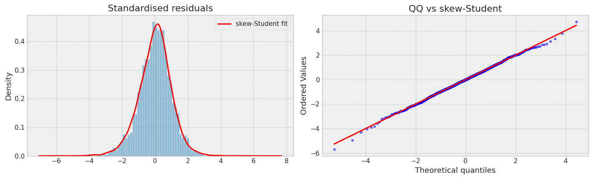
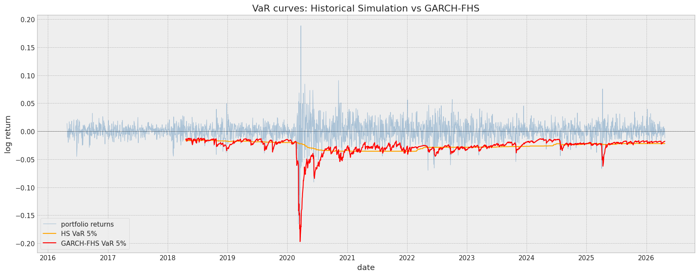
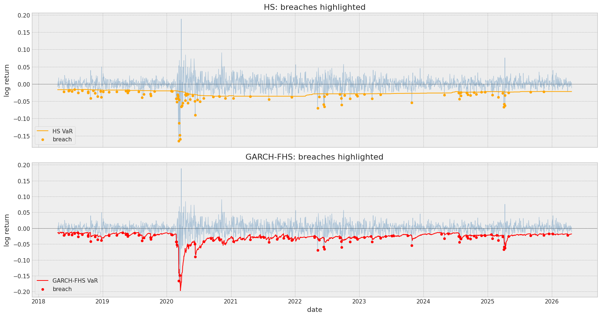
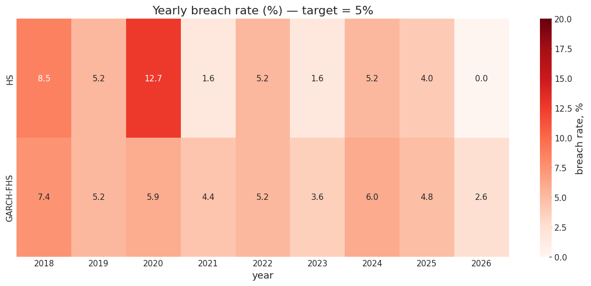
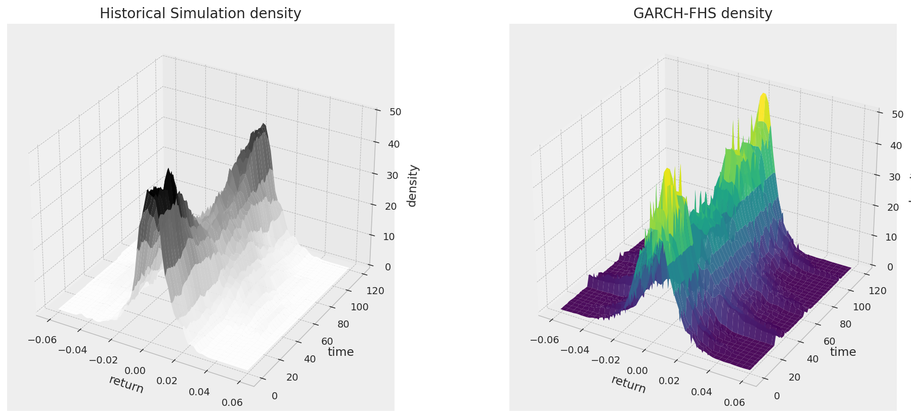

<div align="center">

# Portfolio VaR / ES: Historical Simulation vs GARCH-FHS

**A comparative study of two industry-standard approaches to one-day-ahead portfolio risk on a cyclicals portfolio (energy + autos).**

[](https://www.python.org/downloads/)
[](https://jupyter.org/)
[](https://github.com/bashtage/arch)
[](https://opensource.org/licenses/MIT)
[](https://colab.research.google.com/github/eeklkve/portfolio-var-hs-vs-fhs/blob/main/portfolio_var_hs_vs_fhs.ipynb)

</div>

---


## TL;DR

Two methods on the same backtesting protocol over 10 years of daily data on XOM, CVX, COP, F, GM:

| Method | Breach rate | Kupiec coverage | Christoffersen independence |
|---|---|---|---|
| Historical Simulation (rolling 500-day window) | 5.16 % | passes | **fails** (stat = 11.16) |
| GARCH-FHS (GJR-GARCH + skew-Student + FHS) | 5.11 % | passes | passes (stat = 0.58) |

Both methods produce a breach rate close to the 5% target, but HS clusters its breaches in stress regimes (12.7% in 2020, 1.6% in 2021, 1.6% in 2023). GARCH-FHS spreads them evenly across years (5.9%, 4.4%, 3.6% in the same years). The Christoffersen statistic captures this difference cleanly: HS at 11.16 is far above the 3.84 critical value, GARCH-FHS at 0.58 is well inside the acceptance region.



---

## Table of contents

- [Motivation](#motivation)
- [Data](#data)
- [Methodology](#methodology)
  - [Historical Simulation](#historical-simulation)
  - [GARCH-FHS](#garch-fhs)
  - [Backtests](#backtests)
- [Results](#results)
- [Repository structure](#repository-structure)
- [Quickstart](#quickstart)
- [Reproducing the figures and animations](#reproducing-the-figures-and-animations)
- [Deploying to GitHub](#deploying-to-github)
- [References](#references)

---

## Motivation

Historical Simulation is the most common parametric-free approach to VaR, allowed under Basel and widely used in practice for its simplicity. Its weakness is well known: it averages over a long window and so reacts to regime changes only with a lag of one window length.

GARCH-FHS keeps the empirical shape of HS residuals but adds a conditional scaling step that responds to current volatility immediately. The question this project asks is whether that added complexity is actually worth it on a typical cyclical-equity portfolio, measured by formal coverage and independence tests rather than narrative argument.

A cyclicals portfolio is chosen on purpose: high vol-of-vol, repeated regime changes (COVID 2020, 2022 rate shock, 2023 banking crisis, oil cycles), high cross-correlations within the energy block. If conditional models are going to matter anywhere, it is here.

---

## Data

5 large-cap US cyclical stocks, equal-weighted:

| Ticker | Company         | Sector  |
|--------|-----------------|---------|
| XOM    | Exxon Mobil     | Energy  |
| CVX    | Chevron         | Energy  |
| COP    | ConocoPhillips  | Energy  |
| F      | Ford            | Autos   |
| GM     | General Motors  | Autos   |

Daily `Close` prices over the last 10 years from Yahoo Finance. Log-returns:

$$r_t = \ln \frac{P_t}{P_{t-1}}$$

Equal weights $w_i = 1/5$ over all five names. Within-sector correlations sit at 0.81–0.83 (energy) and 0.75 (autos), cross-sector at 0.39–0.46. The energy block dominates the portfolio's volatility regime.

The portfolio return distribution has excess kurtosis of 16.7 and skewness of -0.53, which is typical for cyclical equity baskets and motivates the use of fat-tailed conditional distributions over Gaussian models.

---

## Methodology

### Historical Simulation

On each day $t$ take the trailing window of 500 portfolio returns and use the empirical distribution directly:

$$\widehat{\text{VaR}}_\alpha^{HS}(t) = Q_\alpha\bigl(\{r_{t-L}, \ldots, r_{t-1}\}\bigr)$$

$$\widehat{\text{ES}}_\alpha^{HS}(t) = \frac{1}{|S|} \sum_{r \in S} r,\quad S = \{r : r \leq \widehat{\text{VaR}}_\alpha^{HS}(t)\}$$

No distributional assumption, no parameter estimation.

### GARCH-FHS

Model portfolio returns directly with GJR-GARCH(1,1,1) under a HAR(1) mean and skew-Student innovations:

$$r_t = \mu_t + \sqrt{h_t}\,\varepsilon_t,\qquad \varepsilon_t \sim \text{SkewStudent}(\eta, \lambda)$$

$$h_t = \omega + \alpha\,\epsilon_{t-1}^2 + \gamma\,\epsilon_{t-1}^2\,\mathbb{1}_{\{\epsilon_{t-1} < 0\}} + \beta\,h_{t-1}$$

The $\gamma$ term is the leverage effect: bad news raises future volatility more than equally-sized good news. Returns are scaled by $10/\sigma$ before fitting for numerical stability, following the convention in the `arch` package.

In-sample estimates on the full sample give $\alpha = 0.038$, $\gamma = 0.060$, $\beta = 0.923$ with $\eta = 7.71$, $\lambda = -0.10$ — moderate persistence, mild but significant leverage, heavy left tail.

Filtered Historical Simulation builds the predictive distribution from the empirical residuals scaled by the next-step conditional moments:

$$\hat r_{t+1} = \hat\mu_{t+1} + \sqrt{\hat h_{t+1}}\,\hat\varepsilon$$

where $\hat\varepsilon$ ranges over all in-sample standardised residuals. This combines the conditional scaling from GARCH with the empirical shape of past shocks, without adding a bootstrap step that would inject noise.

Residual diagnostics confirm the model captures the volatility clustering:



### Backtests

Define the breach indicator $V_t = \mathbb{1}_{\{r_t < \text{VaR}_t\}}$.

**Kupiec unconditional coverage** asks whether the breach rate equals the target $\alpha$:

$$LR_{uc} = -2\ln\frac{\alpha^x(1-\alpha)^{n-x}}{\hat p^x(1-\hat p)^{n-x}} \sim \chi^2(1)$$

**Christoffersen independence** uses the $V_{t-1} \to V_t$ transition counts to test whether breaches cluster in time. Also $\chi^2(1)$.

Both pass at the 95% level if the statistic is below $\chi^2_{0.95}(1) \approx 3.841$.

---

## Results

### VaR curves



HS is slow-moving and inertial. It widens with a lag after a large drawdown enters the window and narrows with a lag when the drawdown leaves. GARCH-FHS reacts within days to volatility shocks and contracts back as quickly when the regime calms.

### Breach maps



Under HS the breaches form a tight cluster in March–April 2020 and another smaller cluster in 2022, with long quiet stretches in between. Under GARCH-FHS they are spread across the sample.

### Yearly breach rates



The heatmap is the cleanest summary. HS breach rate swings from 0.0 % in 2026 and 1.6 % in 2021/2023 to 12.7 % in 2020 — a 7-fold range. GARCH-FHS stays in a narrow 2.6–7.4 % corridor across all years, exactly the picture you want from a calibrated risk model.

### Backtest table

| Metric | Historical Simulation | GARCH-FHS |
|---|---|---|
| Observations | 2014 | 2014 |
| Breaches | 104 | 103 |
| Breach rate | 5.16 % | 5.11 % |
| Mean breach size | -0.0163 | -0.0097 |
| Kupiec statistic | 0.11 | 0.05 |
| Christoffersen statistic | **11.16** | 0.58 |
| Coverage test | passes | passes |
| Independence test | **fails** | passes |

### 3D density surfaces



For each historical day there is a one-step-ahead distribution from which the next return is being predicted. Stacking those distributions along the time axis gives a surface where X is portfolio return, Y is time and Z is density. Under HS the surface is a slow-moving plateau driven by the 500-day window. Under GARCH-FHS it is a ridge with sharp valleys where conditional volatility expanded around shocks.

The animated version at the top of this README walks through the same surfaces frame by frame, with the time axis filling in left to right.

---

## Conclusions

The headline finding is that on a cyclicals portfolio with strong volatility clustering, non-parametric historical simulation gives the right average risk number for the wrong reason. It earns its 5 % by averaging over good and bad regimes and concentrates breaches in stress periods. From a practical risk-management standpoint this is the worst failure mode — the model underestimates risk precisely when the firm needs the cushion.

GARCH-FHS keeps the empirical shape of the residual distribution, which is what makes HS attractive in the first place, but adds a conditional scale that follows the regime. The result is a calibrated breach rate that does not cluster in time. The added complexity is a single GARCH refit per day, which is cheap and well understood.

The reason this comparison is interesting and not just textbook is that HS is still widely used in practice for the simplicity argument. The numbers here illustrate quantitatively what regulators and risk modellers usually argue for in words: conditional models are not a luxury when volatility regimes are this pronounced.

---

## Repository structure

```
.
├── portfolio_var_hs_vs_fhs.ipynb   Main research notebook
├── README.md
├── requirements.txt
├── LICENSE
├── .gitignore
└── images/
    ├── var_evolution.gif           Hero animation: VaR drawing itself
    ├── density_evolution.gif       3D density surfaces growing over time
    ├── density_surfaces_static.png Static 3D snapshot
    ├── var_curves.png              Both VaR curves overlaid
    ├── breach_maps.png             Breaches highlighted per method
    ├── yearly_heatmap.png          Heatmap of yearly breach rates
    └── residual_diagnostics.png    Histogram + QQ of standardised residuals
```

---

## References

- Christoffersen, P. (1998). *Evaluating Interval Forecasts*. International Economic Review.
- Kupiec, P. (1995). *Techniques for Verifying the Accuracy of Risk Measurement Models*.
- Glosten, L., Jagannathan, R., Runkle, D. (1993). *On the Relation between the Expected Value and the Volatility of the Nominal Excess Return on Stocks*.
- Barone-Adesi, G., Giannopoulos, K., Vosper, L. (1999). *VaR without Correlations for Portfolios of Derivative Securities* — original FHS paper.
- Engle, R. (1982). *Autoregressive Conditional Heteroscedasticity with Estimates of the Variance of United Kingdom Inflation*.
- McNeil, A. J., Frey, R., Embrechts, P. (2015). *Quantitative Risk Management*.
- [`arch`](https://github.com/bashtage/arch) — Kevin Sheppard's volatility models package.

---

<div align="center">

*Educational project. Not financial advice.*

</div>
